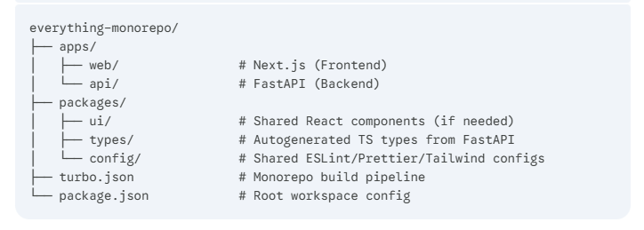

# Everything.co.ke | Full-Stack Monorepo



Welcome to the central monorepo for **Everything.co.ke**. This repository contains the full-stack application, including a high-performance FastAPI backend and a modern Next.js frontend. The project is structured as a monorepo to streamline development, share code, and simplify configuration management.

## 🚀 Core Technologies

| Area      | Technology                                           |
| :-------- | :--------------------------------------------------- |
| **Frontend**  | [Next.js](https://nextjs.org/) (App Router), [React](https://reactjs.org/), [TypeScript](https://www.typescriptlang.org/), [Tailwind CSS](https://tailwindcss.com/) |
| **Backend**   | [FastAPI](https://fastapi.tiangolo.com/), [Python 3.12](https://www.python.org/), Pydantic, Gunicorn/Uvicorn |
| **Database**  | PostgreSQL (via Prisma on the frontend, SQLAlchemy on the backend) |
| **DevOps**    | [Docker](https://www.docker.com/), [GitHub Actions](https://github.com/features/actions), Docker Hub, Docker Compose |

## 🛠️ Getting Started

Follow these instructions to get the project running on your local machine for development and testing purposes.

### Prerequisites

- [Docker & Docker Compose](https://www.docker.com/products/docker-desktop)
- [Python 3.12+](https://www.python.org/downloads/) (for local backend development)
- [Node.js 20+](https://nodejs.org/) (for local frontend development)

### Local Development

1.  **Clone the Repository**
    ```bash
    git clone https://github.com/davie-karanja/everything-monorepo.git
    cd everything-monorepo
    ```

2.  **Run the Backend (FastAPI)**
    ```bash
    cd apps/backend
    python -m venv venv
    # On Windows
    .\venv\Scripts\activate
    # On macOS/Linux
    source venv/bin/activate
    pip install -r requirements.txt
    uvicorn main:app --reload
    ```
    The backend will be available at `http://localhost:8000`.

3.  **Run the Frontend (Next.js)**
    ```bash
    cd apps/web
    npm install
    npm run dev
    ```
    The frontend will be available at `http://localhost:3000`.

### Docker-Based Development

For a more isolated and consistent environment, you can use Docker Compose to run the entire stack.

```bash
# Build and run all services
docker-compose up --build
```

## 🏗️ Project Structure

This project uses a monorepo architecture to manage the frontend and backend in a single repository.

```
everything-monorepo/
├── .github/workflows/       # Automated CI/CD (GitHub Actions)
├── apps/
│   ├── backend/             # FastAPI Backend (Python)
│   └── web/                 # Next.js Frontend (TypeScript)
├── packages/                # (Future) Shared configurations and logic
├── .dockerignore            # Global Docker ignore rules
└── docker-compose.yml       # Local orchestration
```

-   **`apps/backend`**: Contains the FastAPI application, including API routes, database models, and business logic.
-   **`apps/web`**: Contains the Next.js frontend application, including pages, components, and client-side logic.
-   **`packages/`**: Intended for shared code, such as validation schemas, utility functions, or UI components that can be used by both applications.

## 🐳 CI/CD Pipeline

Our deployment process is automated using GitHub Actions with reusable workflows.

-   **Trigger Logic**: The CI/CD pipeline is triggered on pushes to the `dev` and `main` branches, or when a Git tag (e.g., `v1.0.0`) is pushed.
-   **Path Filtering**: Builds are optimized to only run if relevant files have changed. For example, a backend build is only triggered if files in `apps/backend/` are modified.
-   **Deployment**: The pipeline builds and pushes versioned Docker images to Docker Hub, ready for deployment.

## 🤝 Contributing

Contributions are welcome! Please feel free to submit a pull request or open an issue if you have ideas for improvements.

1.  Fork the repository.
2.  Create your feature branch (`git checkout -b feature/AmazingFeature`).
3.  Commit your changes (`git commit -m 'Add some AmazingFeature'`).
4.  Push to the branch (`git push origin feature/AmazingFeature`).
5.  Open a Pull Request.

## 📄 License

This project is private and proprietary. See the [LICENSE.md](LICENSE.md) file for details.
